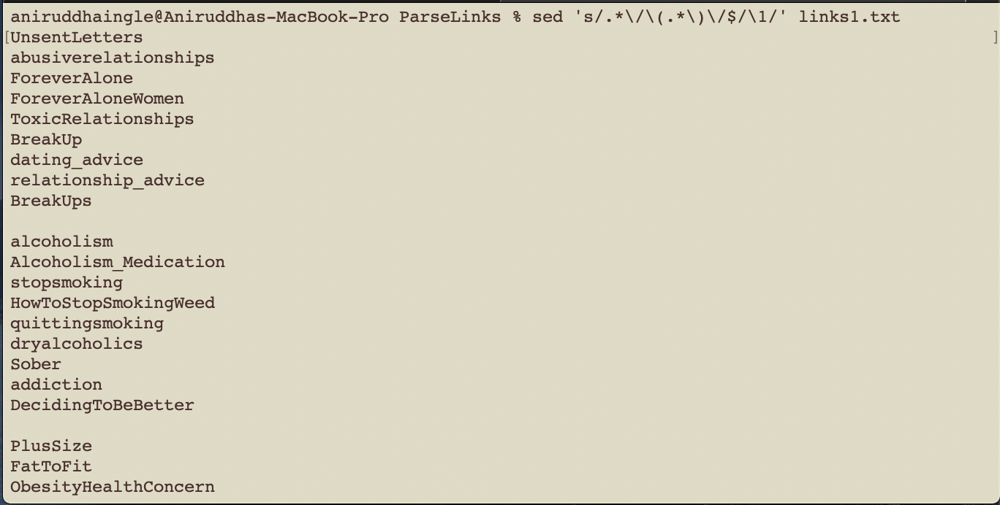

## Extracting Community Names from Thousands of Links 
### Part A: (Java Program) & Part B: (Unix Command) 

## Part A: Java Program

[Watch Video Demonstraion](https://www.youtube.com/watch?v=H7nbVwMha8w)
  
## Problem: Google Sheet has MANY Reddit Links, Pupulating the Community Names Column is Arduous

## Solution: Write a Program!  

I copied the entire column of links into a text file. I saw one link which was in double quotes, removed them, saved the file.  
  
The google sheet was not too bad, but there were some entries that were not links, so, I split the link string at ":" made sure the 0th element is "https" then within split the 1st element which is the link component that has the community name using the delimiter "/".   
  
The last element in this String array was my community name. Furthermore, I deleted those rows from the google sheet. You will see why.  
  
##### The important thing here is to make sure the empty lines within the links file are retained in the communityNames file. Now, our sheet is coherent with the content of the communityNames file. Simply, copy the entire file and paste it in the google sheet.

## Part B: Unix Command  
Navigate to the folder where your .txt file is and run the following command (remember to swap your filename in for 'links1.txt')

$ sed 's/.*\/\(.*\)\/$/\1/' links1.txt  
  
This command will print out all the community names in the console, like so - 

